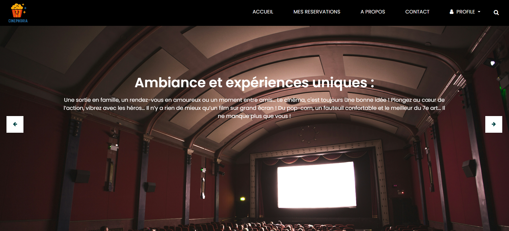
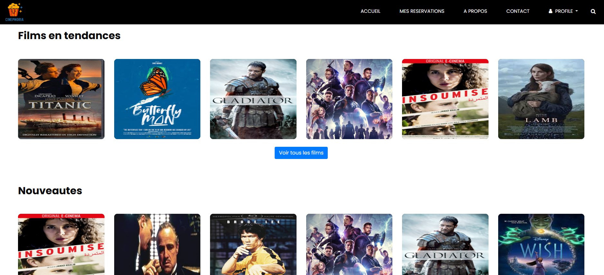
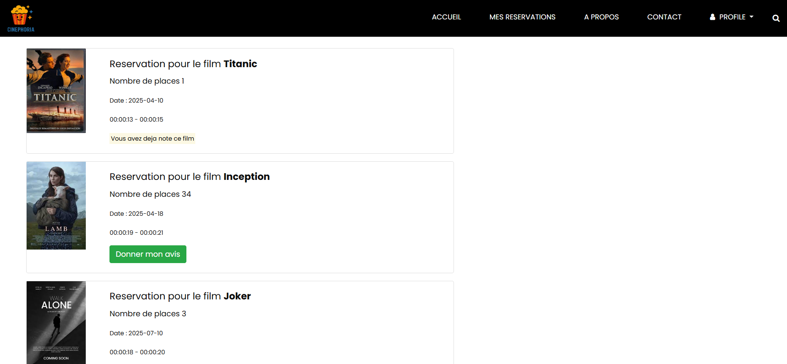
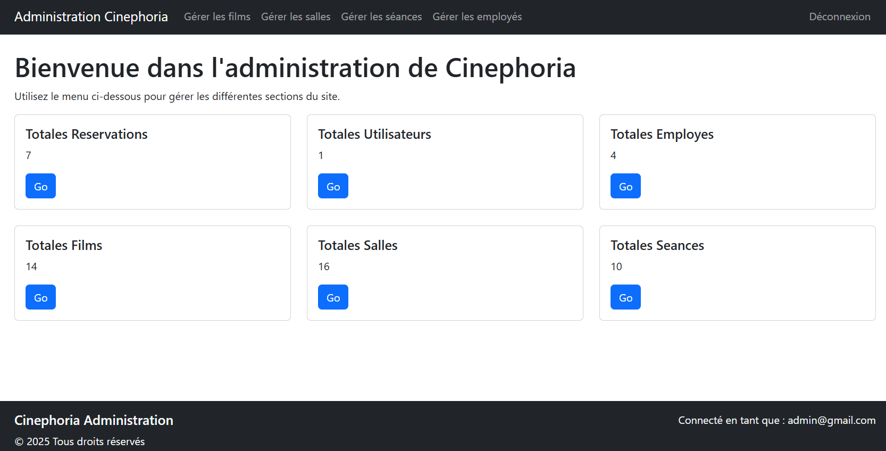
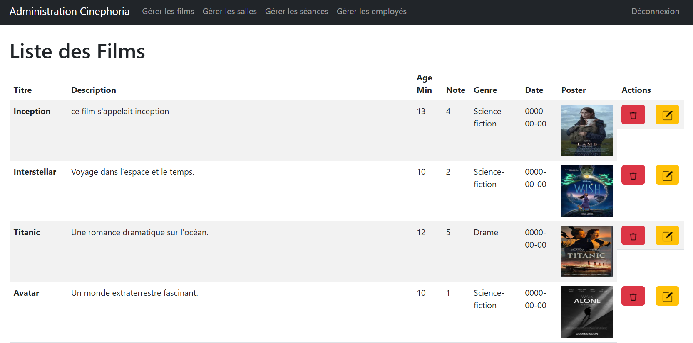
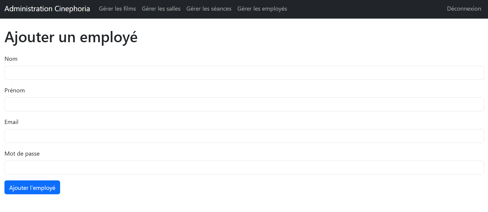

# 🎬 Cinéphoria – Application Web
 <a href="https://abdou.website/Cinephoria/Vues/index.php"> www.Cinéphoria.com </a>
est une application web de gestion de cinéma développée en PHP avec une base de données MySQL. Elle permet aux visiteurs de réserver des séances de cinéma, aux utilisateurs de gérer leurs commandes, et aux administrateurs/employés de gérer les films, salles, séances et utilisateurs.

---

## 🧩 Fonctionnalités principales

### 🌐 Côté Visiteur (non connecté)
- Accueil : voir les films ajoutés le dernier mercredi.
- Menu (visible sur toutes les pages) : Accueil, Connexion, Réservation, Films, Contact.
- Réservation : sélection du cinéma, film, séance, qualité, nombre de places, sièges.
- Films : affichage + filtres (cinéma, genre, jour), note moyenne, « coup de cœur ».
- Création de compte avec mot de passe sécurisé + mail de confirmation.

### 🔐 Côté Utilisateur
- Connexion sécurisée.
- Mon espace : voir ses réservations, noter un film après séance expirée.
- Note (sur 5) et description visibles sur la page du film.

### 🛠️ Espace Employé
- Gestion des films, séances, salles.
- Validation ou suppression des avis.
- Accès via le bouton **Intranet** après connexion.

### 🧑‍💼 Espace Administrateur

<a href="https://abdou.website/Cinephoria/Vues/Admin/index.php"> www.Admin-Cinéphoria.com </a>
- Accès via le menu **Administration** après authentification.
- Gestion complète des films, séances, salles.
- Création de comptes employé.
- Réinitialisation de mot de passe employé.
- Dashboard (statistiques sur 7 jours depuis une base NoSQL).

---

## 🛠️ Technologies

- 💻 Langage : PHP
- 🗃️ Base de données : MySQL (phpMyAdmin)
- 🌐 Backend : API REST PHP (pour la version mobile)
- 🎨 Frontend : HTML, CSS (bootstrap)
- 📈 Dashboard admin : base NoSQL pour les statistiques

---

## 🚀 Installation

1. Cloner le projet dans votre serveur local (WAMP/XAMPP).
2. Importer le fichier SQL dans **phpMyAdmin** (`cinephoria`).
3. Configurer la connexion MySQL dans les fichiers PHP.
4. Lancer `localhost/Cinephoria` depuis le navigateur.

---

## 📬 Contact

Développé par **Abdoma**  
📧 Email : abdoma.dev@gmail.com  
🔗 GitHub : [github.com/abdoma-git](https://github.com/abdoma-git)

