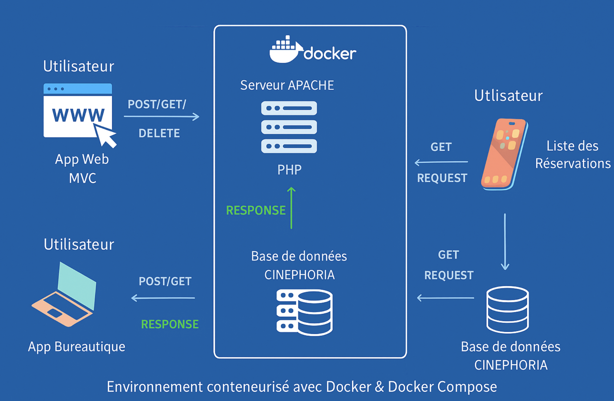
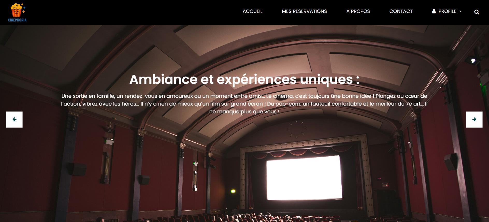
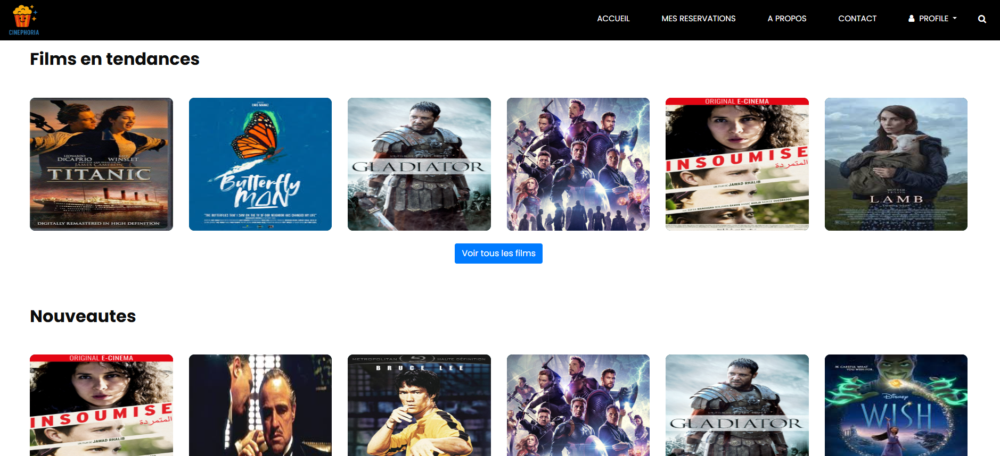
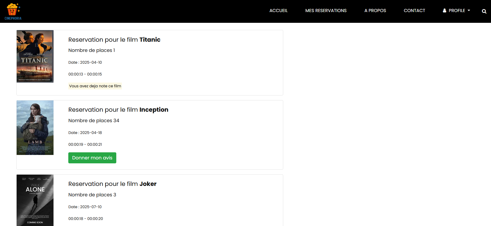
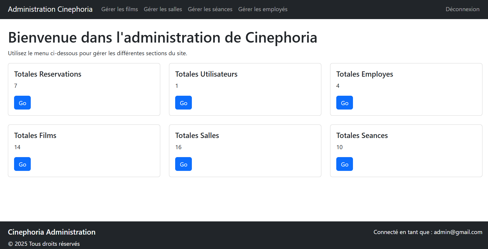
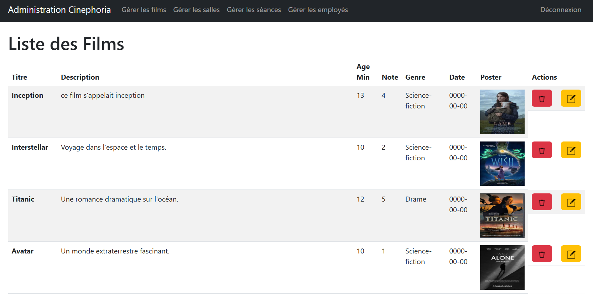
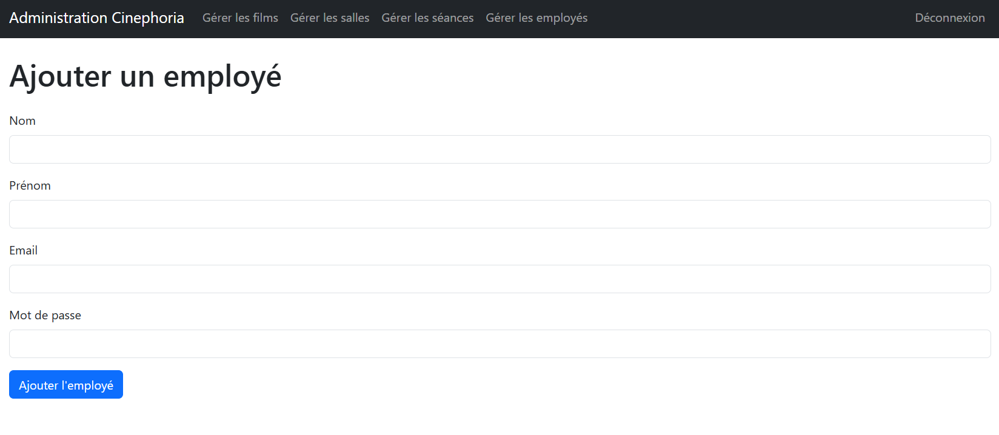

# 🎬 Cinéphoria – Application Web
 <a href="https://abdou.website/Cinephoria/Vues/"> www.Cinéphoria.com </a>
est une application web de gestion de cinéma développée en PHP avec une base de données MySQL. Elle permet aux visiteurs de réserver des séances de cinéma, aux utilisateurs de gérer leurs commandes, et aux administrateurs/employés de gérer les films, salles, séances et utilisateurs.

### Docker

🚀 L’application est entièrement conteneurisée grâce à **Docker**, ce qui facilite le déploiement, l’isolation des services (Apache, PHP, Base de données) et assure une reproductibilité de l’environnement sur toutes les machines.




# Documents A rendres

- Le Rapport ECF Cinephoria des 3 Applications (Web, Mobile Desktop) --> <a href="https://github.com/abdoma-git/Cinephoria/blob/master/Rapport_ECF_Cinephoria_MOHAMED_Abdou.pdf"> Rapport ECF </a>

- Le Charte Graphique du site --> <a href="https://github.com/abdoma-git/Cinephoria/blob/master/Documents_A_Rendre/Chartes-graphique-cinephoria.pdf"> Charte Graphique </a>

- Maquettes --> <a href="https://github.com/abdoma-git/Cinephoria/blob/master/Documents_A_Rendre/maquettes Cinephoria.pdf"> Maquettes + Palette </a>

- Le fichier SQL des transactions sql --> <a href="https://github.com/abdoma-git/Cinephoria/blob/master/Documents_A_Rendre/cinephoria.sql"> Transactions sql </a>

- Documentation --> <a href="https://github.com/abdoma-git/Cinephoria/blob/master/Documents_A_Rendre/Documentation.pdf"> Documentation </a>

- Les identifiants pour tester l'application --> <a href="https://github.com/abdoma-git/Cinephoria/blob/master/Documents_A_Rendre/Les identifiants de Cinephoria.pdf"> Identifiants </a>

- Gestion de Projet --> <a href="https://github.com/abdoma-git/Cinephoria/blob/master/Documents_A_Rendre/Gestion_projet.pdf"> Gestion de Projet </a>

- Statistique + MongoDB --> <a href="https://github.com/abdoma-git/Cinephoria/blob/master/Documents_A_Rendre/STATISTIQUES.pdf"> Statistiques </a>

- Configuration --> <a href="https://github.com/abdoma-git/Cinephoria/blob/master/Documents_A_Rendre/Configurations.pdf"> Configuration </a>

---

# Lancer une Application PHP en Local avec WAMP

Ce guide explique comment configurer et exécuter une application PHP localement en utilisant wamp, `www`, PhpMyAdmin et Visual Studio Code.

## Prérequis

- [wamp](https://www.wamp.info/en/downloads/)
- [Visual Studio Code](https://code.visualstudio.com/Download)
- Navigateur web (comme Chrome, Firefox, etc.)

## Étapes pour Lancer l'Application

### 1. Installation de wamp

1. Téléchargez et installez [wamp](https://www.wamp.info/en/downloads/) sur votre machine.
2. Une fois installé, lancez wamp.
3. Assurez-vous que le serveur Apache et MySQL sont démarrés. Vous pouvez voir leur statut dans la fenêtre de wamp.

### 2. Configuration de l'Environnement Local

1. **Configurer le dossier `www` :**
   - Placez votre projet PHP dans le répertoire `www` de wamp. Par défaut, ce répertoire se trouve ici :
     - **macOS** : `/Applications/wamp/www/`
     - **Windows** : `C:\wamp\www\`
   - Par exemple, si votre projet s'appelle `bet-website`, placez-le dans le répertoire `www` de manière à ce qu'il soit accessible via : `C:\wamp\www\bet-website`.

2. **Configuration de la base de données avec PhpMyAdmin :**
   - Accédez à [http://localhost/phpmyadmin](http://localhost/phpmyadmin) dans votre navigateur pour ouvrir PhpMyAdmin.
   - Créez une nouvelle base de données pour votre projet.
   - Importez le fichier SQL (le cas échéant) dans cette base de données pour initialiser les tables.
   - Le lien vers le fichier sql de la basee de donees : <a href="https://github.com/abdoma-git/Cinephoria/blob/master/cinephoria.sql">Cinephoria.sql</a>

### 3. Édition et Configuration du Code avec Visual Studio Code

1. Ouvrez Visual Studio Code.
2. Cliquez sur "File" > "Open Folder..." et sélectionnez le répertoire de votre projet dans `www`.
3. Vérifiez le fichier de configuration de la base de données (souvent `config.php` ou `database.php`) pour vous assurer que les paramètres de connexion à la base de données sont corrects :
   ```php
   <?php
   $host = 'localhost';
   $dbname = 'cinphoria';
   $username = 'root';
   $password = ''; // Ou vide selon la configuration par défaut de wamp
   ?>

## 🧩 Fonctionnalités principales

### 🌐 Côté Visiteur (non connecté)
- Accueil : voir les films ajoutés le dernier mercredi.
- Menu (visible sur toutes les pages) : Accueil, Connexion, Réservation, Films, Contact.
- Réservation : sélection du cinéma, film, séance, qualité, nombre de places, sièges.
- Films : affichage + filtres (cinéma, genre, jour), note moyenne, « coup de cœur ».
- Création de compte avec mot de passe sécurisé + mail de confirmation.





### 🔐 Côté Utilisateur
- Connexion sécurisée.
- Mon espace : voir ses réservations, noter un film après séance expirée.
- Note (sur 5) et description visibles sur la page du film.



### 🛠️ Espace Employé

<a href="https://abdou.website/Cinephoria/Vues/Employe/"> www.Staff-Cinéphoria.com </a>

- Gestion des films, séances, salles.
- Validation ou suppression des avis.
- Accès via le bouton **Intranet** après connexion.

### 🧑‍💼 Espace Administrateur

<a href="https://abdou.website/Cinephoria/Vues/Admin/index.php"> www.Admin-Cinéphoria.com </a>
- Accès via le menu **Administration** après authentification.
- Gestion complète des films, séances, salles.
- Création de comptes employé.
- Réinitialisation de mot de passe employé.
- Dashboard (statistiques sur 7 jours depuis une base NoSQL).





---

## 🛠️ Technologies

- 💻 Langage : PHP
- 🗃️ Base de données : MySQL (phpMyAdmin)
- 🌐 Backend : API REST PHP (pour la version mobile)
- 🎨 Frontend : HTML, CSS (bootstrap)
- 📈 Dashboard admin : base NoSQL pour les statistiques

---

## 🚀 Installation

1. Cloner le projet dans votre serveur local (WAMP/XAMPP).
2. Importer le fichier SQL dans **phpMyAdmin** (`cinephoria`).
3. Configurer la connexion MySQL dans les fichiers PHP.
4. Lancer `localhost/Cinephoria` depuis le navigateur.

---

## 📬 Contact

Développé par **Abdoma**  
📧 Email : abdou.mohamed7949@yahoo.fr  
🔗 GitHub : [github.com/abdoma-git](https://github.com/abdoma-git)

